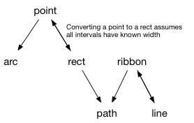

The gggeom package does two things:

* Provides a standard way of representing geometric primitives.
* Manipulated geometric primitives.

Compared to ggplot2, gggeom covers similar functionality to the `stat_` and `position_` functions. But each function in ggeom tends to be simpler, and there's a standard data representation that makes richer composition easier. Additionally, the majority of functions in ggeom have been written in C++, allowing you to work with much larger datasets.

## Geometric primitives

There are only three fundamental geometric primitives needed to draw any graphic:

* points & text: $(x, y)$
* paths & polygons: ${(x_1, y_1), (x_2, y_2), ..., (x_n, y_n)}$

There are three additional primitives that could be drawn using polygons but have additional behaviour that makes polygons a poor fit: (polygons are extremely generate, which limits the types of transformation we can do with them).

* arcs: $([x, y, [r_1, r_2], [\theta_1, \theta_2]])$
* rects (and images): $([x_1, x_2], [y_1, y_2])$
* ribbons: an ordered sequence of intervals: 
  ${(x_{1}, [y_{11}, y_{12}]), ..., (x_n, [y_{n1}, y_{n2}])}$, 
  where $x_i < x_{i+1}$

ggeom uses a standard parameterisation for these geometries. They are always represented as a data frame:

* points, text: `x_` and `y_`, each row represents a point.
* paths, polygons: `x_` and `y_`, each group represents a path/polygon.
* rects: `x1_`, `x2_`, `y1_`, `y2_`.
* ribbons: `x_`, `y1_`, `y2_`.
* arcs: `x_`, `y_`, `r1_`, `r2_`, `theta1_`, `theta2_`.

For each geometric object, ggeom provides a function that generates this representation: `render_point()`, `render_path()`, `render_polygon()`, etc. These functions create an object of class of (e.g.) `c("geometry", "geometry_point", "data.frame")`.

Many of the geoms provided by ggplot2 are a reparameterisation of these primitives:

  * Path:
  
    * segment: a path parameterised by four coordinates
    * line: a path with ordered x
    * step: a line with additional points
    * spoke: a segment specified by a loation, radius and angle
    * function: a line specified by a function
  
  * Rect
  
    * interval: a degenerate rect with zero width in one direction
    * bar: a rect specified by a location and a width
    * tile: a rect specified by a location, height and width

  * Ribbon
  
    * area: a ribbon with `y1 = 0`.

  * Polygon:
  
    * ellipse: a polygon specified by a center, two radiuses and an angle

The parameterisation of the primitives (in terms of locations, not dimensions), is always to be preferred because they're easier to transform.

There are a also a handful of geoms that are combinations of primitives:

* boxplot: two intervals (hinge & whiskers), one point (median) and 
  a set of points (the outliers).
* smooth: line (estimate) + ribbon (standard errors).

## Geometric transformations

* All
    * `geometry_flip()` (except ribbons).
    * `geometry_reflect(dir = "x")`
  
  * Paths/polygons
    * `geometry_interpolate()`
    * `geometry_transform()` (would use [adaptive resampling](http://bost.ocks.org/mike/example/))
    * `geometry_simplify()`
    * `geometry_jitter()`
  
  * Lines
    * `geometry_step()` 
    * `geometry_stack(axis = c("x", "y"))` (converts to ribbons)
    * `geometry_rescale()`
  
  * Points
    * `geometry_jitter()`
    * `geometry_stack(axis = c("x", "y"))` (converts to rects)
    * `geometry_rescale()`
    * `geometry_contour()`
  
  * Ribbons:
    * `geometry_stack()`
    * `geometry_rescale()`
  
  * Rects
    * `geometry_stack(axis = c("x", "y"))`
    * `geometry_rescale()`
    * `geometry_dodge()`
    * `geometry_contour()`
    
  * Arcs
    * `geometry_stack(axis = c("r", "theta"))`
    * `geometry_rescale()`

  * Conversions:
  
    
